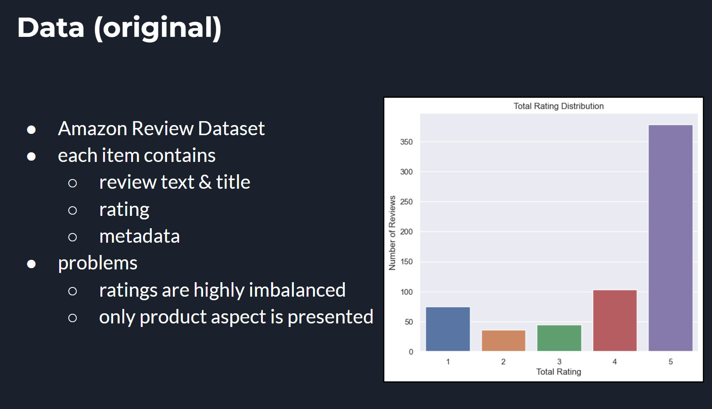
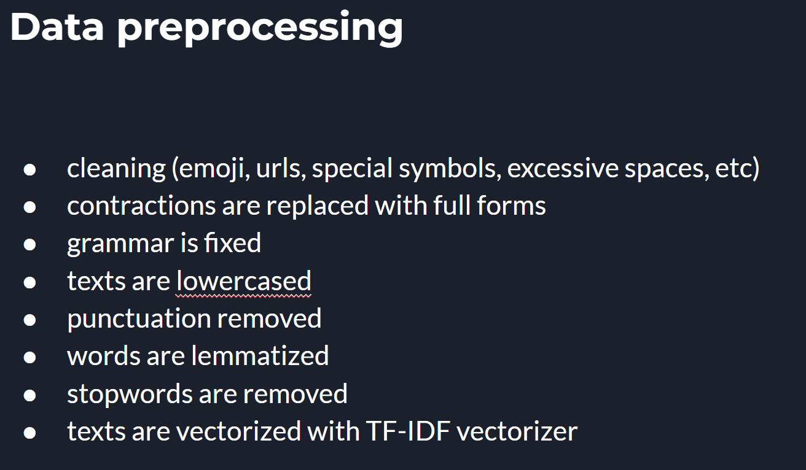
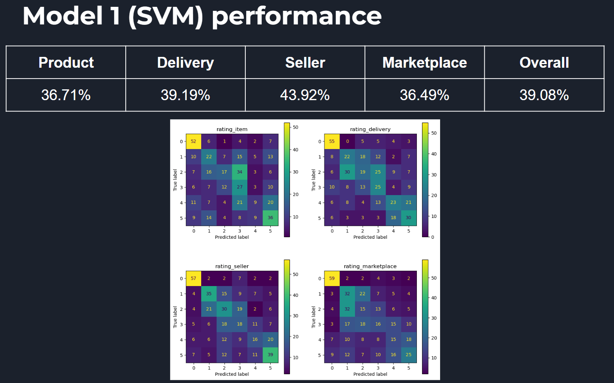
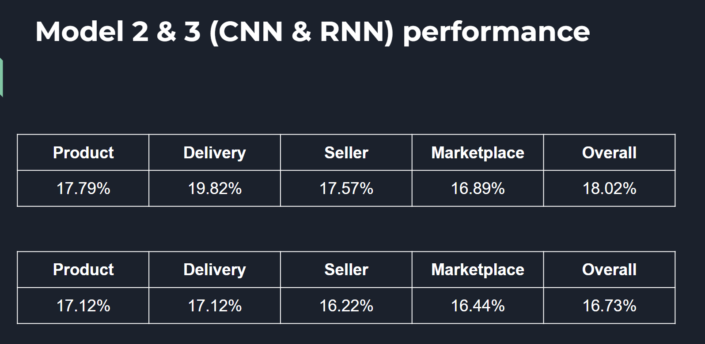
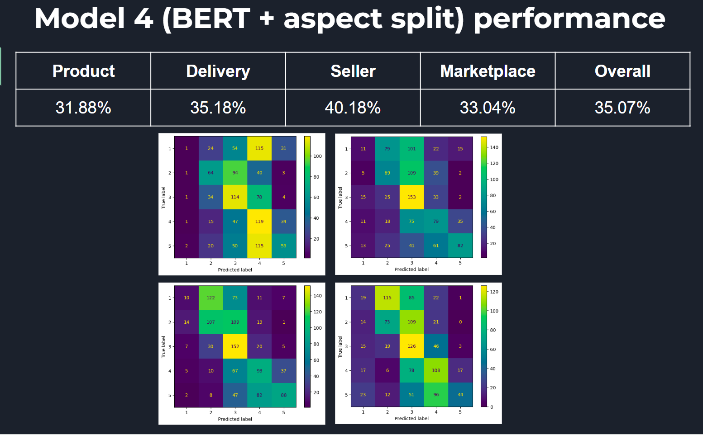
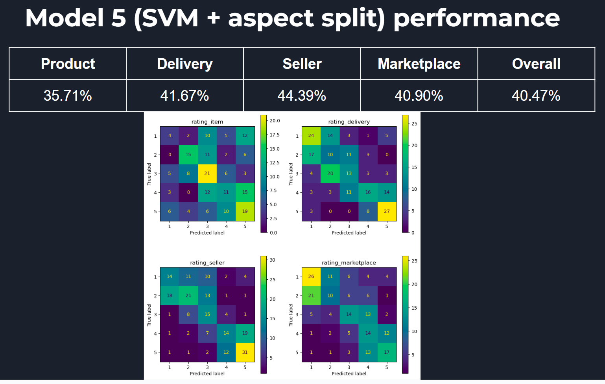

Abstract:
We conducted research on fine-grained aspect-based analysis for product reviews, aiming to develop effective models for this task. However, we faced challenges with data quality, leading to adjustments in the dataset. Although our models did not perform as well as expected, some showed higher accuracy than a baseline. We discuss the implications of our findings and suggest future research directions. The models used include Convolutional Neural Networks (CNN), Recurrent Neural Networks (RNN) with Long Short Term Memory (LSTM), Bidirectional Encoder Representations from Transformers (BERT), Support Vector Machines (SVM), and regular expressions. Our analysis involved metrics such as Receiver Operating Characteristic (ROC) and Confusion Matrix. The source code can be found on our Github repository.

Introduction:
Fine-grained aspect-based analysis of product reviews is crucial for understanding consumer preferences. We aimed to develop an effective model for this task and explore the challenges involved. Analyzing a dataset of product reviews, we sought to improve product design, identify customer needs, and enhance satisfaction. Our research emphasizes the importance of high-quality data and further advancements in this field.

EDA:
We analyzed the dataset at the review level, focusing on individual reviews rather than products or reviewers. The dataset had 3781 unique observations, generated by ChatGPT, with an unknown time period. During the analysis, we discovered that the dataset was highly unbalanced in terms of ratings and aspects presented in reviews. To address this, we generated an artificial dataset using ChatGPT API, ensuring a balanced distribution of aspects and ratings.

Data PreProcessing:
Data cleaning was performed to ensure accuracy, completeness, and consistency. Steps included removing null values and duplicates, eliminating HTML tags, emails, and URLs, replacing accented letters and contractions, removing emojis and special symbols, fixing grammar, lowercasing letters, removing punctuation, lemmatizing words, removing stopwords, and merging titles and texts. Reviews were then vectorized using TF-IDF vectorizer.

Models:
We trained and evaluated several models for classification, including 1D CNN, RNN with LSTM, BERT, and SVM. Accuracy was chosen as the main evaluation metric. Each aspect had a separate model trained with hyperparameters tuning, and the mean accuracy was calculated. The models' performance on the test set and unseen data was analyzed.

Results:
The accuracy of the models varied across aspects. Model 1 (1D CNN) achieved accuracy between 14.92% and 20.90%, Model 2 (RNN/LSTM) between 13.81% and 16.79%, Model 3 (BERT) between 13.81% and 16.79%, and Model 4 (SVM) achieved higher accuracy than other models. However, none of the models performed well enough for production use.

Conclusion:
Despite our efforts, we were unable to develop an effective model for fine-grained aspect-based analysis of product reviews. Our research highlights the challenges in this task and provides insights into the difficulties and complexities involved. Future research should focus on improving data quality and exploring advanced techniques for aspect splitting and classification.
